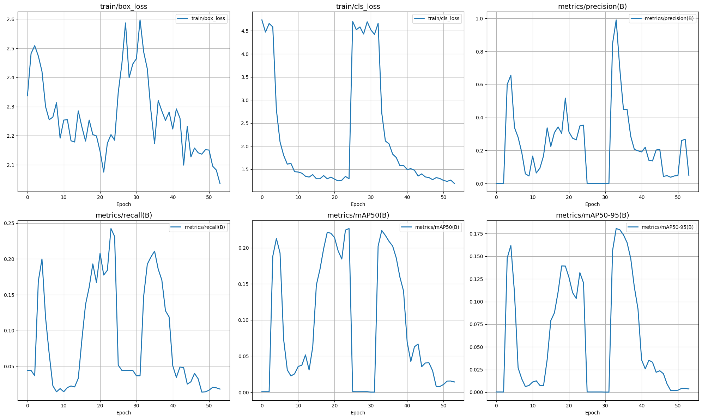
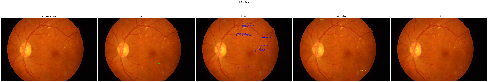

# 📦 YOLOv8 — Détection de Microcalcifications

## 🧠 Contexte

Ce projet est une tentative d'appliquer **YOLOv8** à la **détection automatique de microcalcifications** à partir d’images médicales. Les microcalcifications sont des petits dépôts de calcium visibles sur les mammographies, potentiellement indicateurs précoces de cancer du sein.

Le modèle a été entraîné sur un jeu de données annoté manuellement (taille réduite), avec pour objectif d’évaluer les capacités d’un détecteur à usage général sur ce type d’images.

---

## 🎯 Objectif

L’objectif principal est de :

- Détecter la présence et la localisation des microcalcifications,
- Évaluer les performances quantitatives de YOLOv8 sur un problème médical,
- Comparer les résultats quantitatifs et qualitatifs (sur images affichées).

---

## 📉 Résultats d'entraînement

Les courbes suivantes montrent l'évolution des principales métriques pendant les 100 époques :

  

### 🔎 Analyse :

Le modèle a du mal à converger proprement

mAP@50 and mAP@50-95 reste bas

Precision et recall fluctuent beaucoup au cours des epochs .
---

## 🖼️ Observation qualitative

Malgré les performances **quantitatives modestes**, une visualisation des résultats sur les images montre des **détections correctes et localisées**, comme ci-dessous :

  

Ces résultats suggèrent que le modèle parvient à **apprendre une représentation pertinente**, mais que l’évaluation mAP est pénalisée par :

- Le faible nombre d’échantillons,
- La taille réduite des objets à détecter,
- Le bruit dans les annotations ou la variabilité des images.

---

## 🔧 Pistes d'amélioration

- 🧪 Augmenter le dataset avec des **données annotées supplémentaires**,
- ⚙️ Tester d'autres architectures plus spécialisées (UNet + post-processing),
- 🔬 Ajuster les **seuils de confidence** pour le calcul des métriques,
- 📈 Utiliser du **Test-Time Augmentation (TTA)** ou des techniques d'ensemble,
- 🧊 Geler/dégeler les couches de manière plus fine lors du fine-tuning.

---

## 👨‍💻 Auteurs
- **Juan Reyes-Ortiz**  

