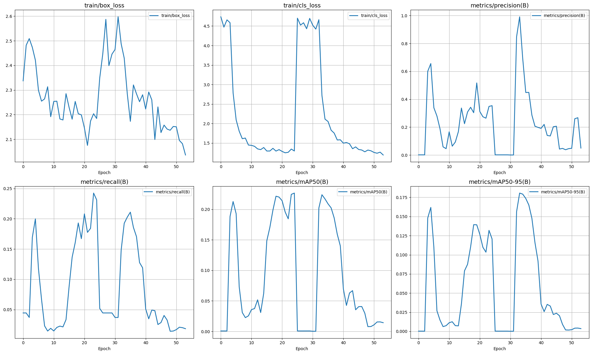
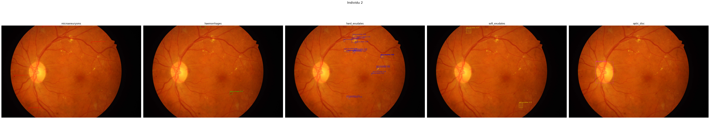

# 📦 YOLOv8 — Détection automatique de lésions de rétinopathie diabétique

## 🧠 Contexte

Ce projet est une tentative d'appliquer **YOLOv8** à la **lésions de rétinopathie diabétique** à partir d’images médicales. 
Le modèle a été entraîné sur un jeu de données annoté manuellement (taille réduite), avec pour objectif d’évaluer les capacités d’un détecteur à usage général sur ce type d’images.

---

## 🎯 Objectif

L’objectif principal est de :

- Détecter la présence et la localisation des lésions,
- Évaluer les performances quantitatives de YOLOv8 sur un problème médical,
- Comparer les résultats quantitatifs et qualitatifs (sur images affichées).
diabétique

## 🧠 Lésions détectées par catégorie (en haut de chaque image) :
microaneurysms (microanévrismes)
→ petites taches rouges (points rouges discrets), premiers signes visibles de la rétinopathie.

haemorrhages (hémorragies)
→ saignements dans la rétine, apparaissent souvent sous forme de taches plus grandes.

hard exudates (exsudats durs)
→ dépôts jaunes brillants, souvent associés à un œdème maculaire.

soft exudates (exsudats mous ou cotons)
→ zones blanchâtres floues, signes d’ischémie (souvent appelés « taches cotonneuses »).

optic disc (disque optique)
→ zone normale de sortie du nerf optique, souvent détectée pour éviter les faux positifs (pas une lésion).

---

## 📉 Résultats d'entraînement

Les courbes suivantes montrent l'évolution des principales métriques pendant les 100 époques :

  

## 🩺 Data Augmentation pour la détection de lésions

Lors de l'entraînement du modèle YOLO, différentes **augmentations de données** ont été appliquées pour améliorer la robustesse et la généralisation, tout en restant réalistes pour un contexte médical.

---

### 1. `mosaic=1.0`
- **Principe** : Combine 4 images différentes dans une seule image.
- **Effet** :
  - Varie les arrière-plans et positions.
  - Modifie l’échelle des objets.
- **Intérêt médical** :
  - Simule différentes positions et tailles de lésions.
  - Désactivé dans les 10 dernières époques (`close_mosaic=10`) pour affiner sur des images réelles.

---

### 2. `mixup=0.2`
- **Principe** : Superpose deux images avec un ratio aléatoire.
- **Effet** :
  - Lisse la frontière entre classes.
  - Ajoute du bruit visuel.
- **Intérêt médical** :
  - Utile pour simuler des lésions peu visibles.
  - Utilisé modérément (20% des batchs) pour préserver la lisibilité.

---

### 3. `hsv_h=0.015`, `hsv_s=0.5`, `hsv_v=0.4`
- **Principe** : Variation aléatoire de teinte (H), saturation (S) et luminosité (V).
- **Effet** :
  - Simule des différences d’éclairage et de contraste.
- **Intérêt médical** :
  - Pertinent pour simuler des variations entre machines ou protocoles d’acquisition.

---

### 4. `degrees=5.0`
- **Principe** : Rotation aléatoire jusqu’à ±5°.
- **Effet** :
  - Rend le modèle robuste aux légères inclinaisons.
- **Intérêt médical** :
  - Reflète les petites rotations dues au positionnement du patient.

---

### 5. `translate=0.1`
- **Principe** : Translation horizontale/verticale jusqu’à 10% de la taille de l’image.
- **Effet** :
  - Simule des variations de cadrage.
- **Intérêt médical** :
  - Représente les différences de centrage entre acquisitions.

---

### 6. `scale=0.5`
- **Principe** : Zoom aléatoire (±50%).
- **Effet** :
  - Rend le modèle robuste à des tailles variées de lésions.
- **Intérêt médical** :
  - Simule des images prises avec différents niveaux de zoom.

---

### 7. `shear=2.0`
- **Principe** : Cisaillement (skew) horizontal/vertical jusqu’à ±2°.
- **Effet** :
  - Introduit de légères distorsions géométriques.
- **Intérêt médical** :
  - Simule les étirements liés à la numérisation ou reconstruction d’image.

---

### 8. `flipud=0.0`, `fliplr=0.0`
- **Principe** : Flip vertical/horizontal (désactivé ici).
- **Effet** :
  - Évite d’inverser la gauche/droite ou haut/bas.
- **Intérêt médical** :
  - Important pour ne pas fausser l’anatomie.

Precision et recall fluctuent beaucoup au cours des epochs .
---

## 🖼️ Observation qualitative

Malgré les performances **quantitatives modestes**, une visualisation des résultats sur les images montre des **détections correctes et localisées**, comme ci-dessous :

  

Ces résultats suggèrent que le modèle parvient à **apprendre une représentation pertinente**, mais que l’évaluation mAP est pénalisée par :

- Le faible nombre d’échantillons,
- La taille réduite des objets à détecter,
- Le bruit dans les annotations ou la variabilité des images.

- ⚠️ Les métriques d’évaluation (mAP, précision, rappel) sont relativement faibles, mais les résultats visuels restent satisfaisants dans la plupart des cas. Ce décalage souligne une limitation connue des métriques standards, qui ne reflètent pas toujours la qualité perçue visuellement, notamment dans les tâches où quelques détections pertinentes suffisent. Une inspection visuelle reste donc essentielle pour juger de la performance réelle du modèle.

---

## 🔧 Pistes d'amélioration

- 🧪 Augmenter le dataset avec des **données annotées supplémentaires**,
- ⚙️ Tester d'autres architectures plus spécialisées (UNet + post-processing),
- 🔬 Ajuster les **seuils de confidence** pour le calcul des métriques,
- 📈 Utiliser du **Test-Time Augmentation (TTA)** ou des techniques d'ensemble,
- 🧊 Geler/dégeler les couches de manière plus fine lors du fine-tuning.

---

## 👨‍💻 Auteurs
- **Juan Reyes-Ortiz**  

